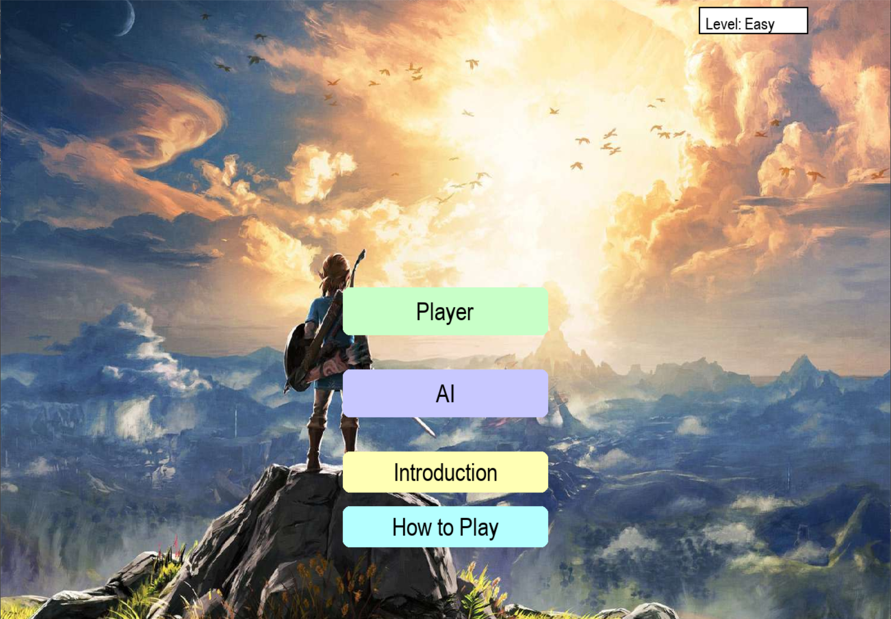
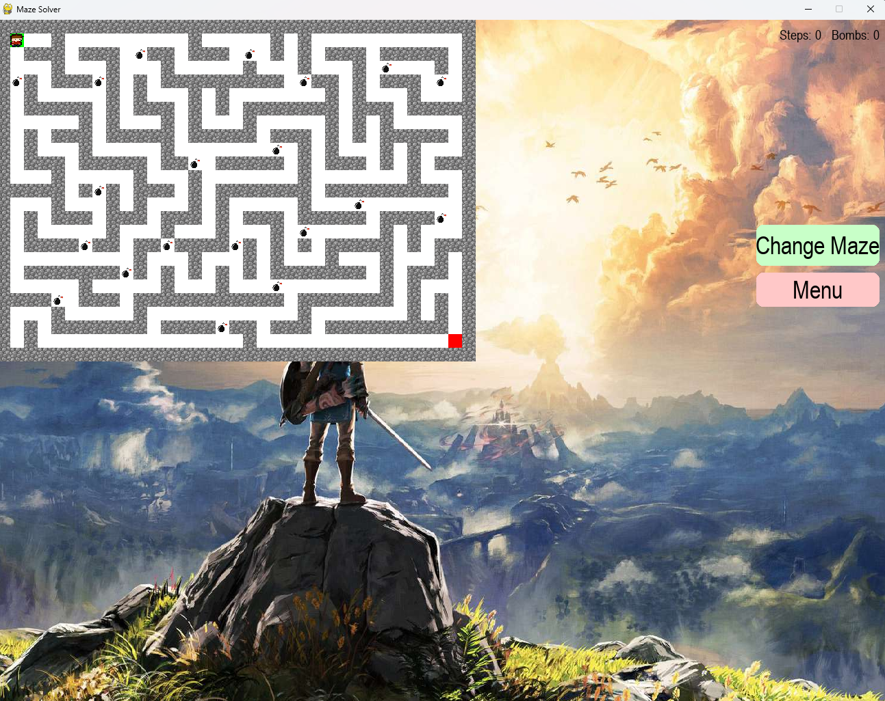
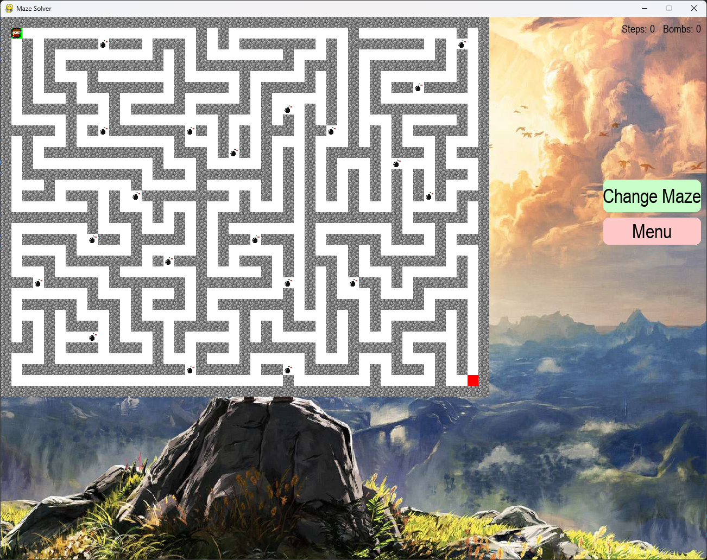
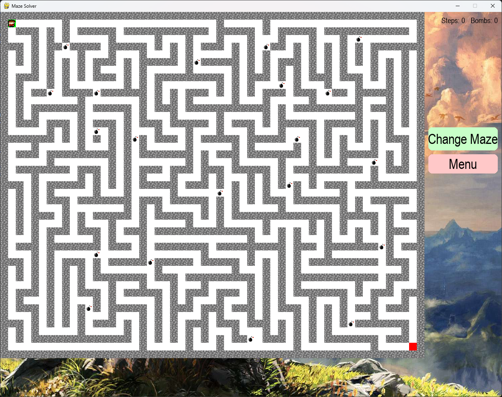
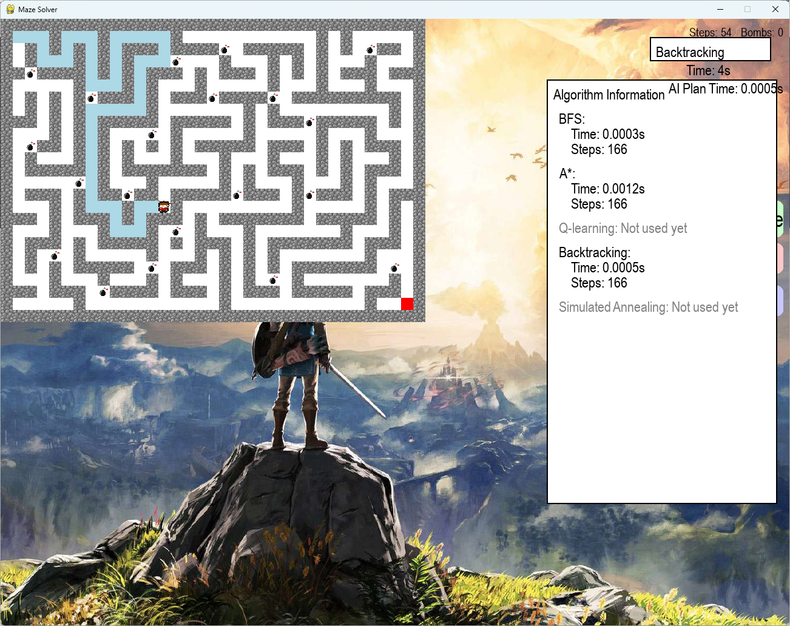
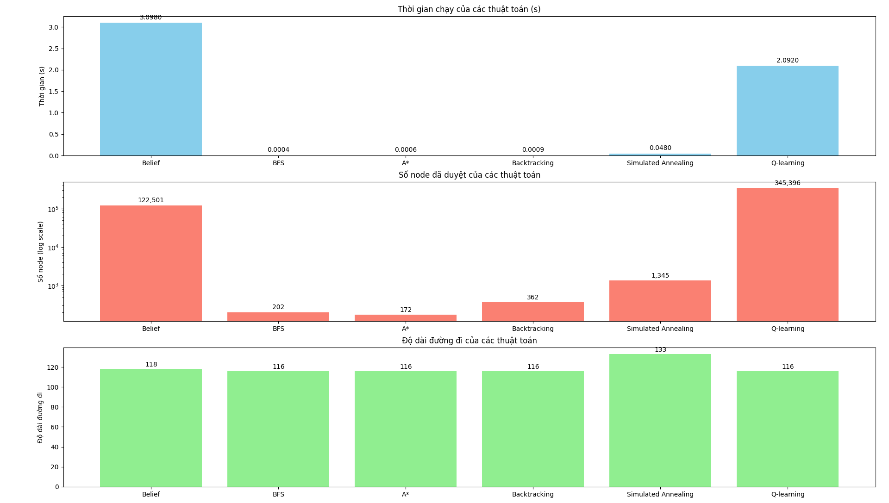

# 🎮 Dream Pursuer - AI Maze Solver Game

**Dream Pursuer** là đồ án cuối kỳ môn Trí tuệ Nhân Tạo, với mục tiêu xây dựng một trò chơi vượt mê cung 2D ứng dụng các thuật toán tìm kiếm thông minh. Trò chơi mang phong cách hoài cổ, kết hợp giữa đồ họa đơn giản, dễ chơi và công nghệ hiện đại như AI và học tăng cường (Reinforcement Learning).

---

## 1. Phát biểu bài toán

Đến với đề tài đồ án Trí tuệ nhân tạo lần này, nhóm chúng em quyết định làm trò chơi mang tên “Dream Pursuer” với bản chất là trò chơi vượt mê cung để tìm đường đi ngắn nhất để thoát khỏi mê cung bằng cách áp dụng những thuật toán tìm kiếm đã học ở lớp. Trò chơi của nhóm chúng em được lấy ý tưởng từ trò chơi giải mê cung cổ điển. Từ ý tưởng đó nhóm chúng em mong muốn được xây dựng và phát triển một trò chơi mang hơi hướng như vậy nhưng có những cải tiến và mới mẻ hơn, hợp mắt người chơi hơn. Bên cạnh đó chúng em còn mong muốn góp phần mang lại cho người chơi cảm giác hoài niệm khi chơi những tựa game 2D thời xưa trong thời đại game MOBA, game 3D đang thống trị hiện nay.

---

## 2. Mục đích và yêu cầu cần thực hiện

### Mục đích:
- Xây dựng một trò chơi mê cung với giao diện và đồ họa đẹp nhằm giúp người chơi cảm thấy thích thú và rèn luyện khả năng tư duy cũng như trí nhớ người chơi.
- Vận dụng kiến thức lập trình Python đã học và những thuật toán tìm kiếm trong môn học Trí tuệ nhân tạo để thiết lập tìm đường đi tối ưu nhất cho bài toán.
- Nâng cao kiến thức về thiết kế game, xử lý đồ họa, thuật toán tìm kiếm (BFS, DFS, A*, Q-learning,...).
- Nâng cao khả năng làm việc nhóm và viết báo cáo.

### Yêu cầu thực hiện:
- Giao diện đồ họa thân thiện, phù hợp với mọi độ tuổi.
- Người chơi có thể di chuyển nhân vật bằng phím.
- Trình phát nhạc khi chơi giúp thêm phần sinh động.
- Bản đồ trò chơi có thể random ngẫu nhiên.
- Có thể chơi 1 người hoặc 2 người.
- Gồm chế độ tự chơi hoặc nhờ AI chơi.
- Tùy chọn nâng cao: có bộ đếm thời gian, số lượt thực hiện và gợi ý đường đi tiếp theo.

---

## 3. Phạm vi và đối tượng

### Phạm vi thực hiện:
- Thiết kế và xây dựng game 2D dạng mê cung với thể loại giải đố.
- Tập trung vào những thao tác điều khiển cơ bản, dễ chơi, dễ sử dụng.
- Không bao gồm yếu tố bạo lực, đối kháng, online hay 3D.

### Đối tượng sử dụng:
- Học sinh, sinh viên và các bạn nhỏ, những người yêu thích tựa game giải đố và suy luận.
- Giảng viên hay những người có nhu cầu sử dụng game như một công cụ minh họa trong giảng dạy thuật toán.

---

## 4. Công cụ và môi trường để lập trình

Công cụ hỗ trợ cho đồ án:
- Git: dùng để quản lý phiên bản mã nguồn.
- Trình chỉnh sửa âm thanh: dùng để chỉnh sửa, cắt ghép lấy âm thanh từ các video trên mạng để thêm vào trò chơi.
- CloudConvert: dùng để chuyển đổi các file mp4 sang mp3 để sử dụng để tạo âm thanh cho trò chơi.
- Các công cụ thiết kế hình ảnh: xây dựng hình ảnh nhân vật, mê cung, chướng ngại vật,...
- Github: dùng để tham khảo một số đoạn code và thuật toán để phục vụ cho việc xây dựng và giải quyết một số vấn đề yêu cầu trong đồ án.
- Môi trường phát triển (IDE): Pycharm là một môi trường phát triển tích hợp IDE mạnh mẽ dành cho python do JetBrains phát triển. Pycharm hỗ trợ quản lý dự án, kiểm tra lỗi, gợi ý mã nguồn và tích hợp dễ dàng với các thư viện bên ngoài.

### Thư viện hỗ trợ lập trình và ngôn ngữ lập trình
- Pygame là thư viện chính, đây cũng là thư viện phổ biến dùng để lập trình game 2D trong Python, hỗ trợ xử lý đồ họa, âm thanh, sự kiện bàn phím,...
- Threading: dùng để xử lý đa luồng, ví dụ như chạy đồng thời nhạc nền, đếm giờ hoặc xử lý các sự kiện khác song song gameplay.
- Time: dùng để xử lý thời gian, chẳng hạn như tính thời gian người chơi trong mê cung, tạo độ trễ trong game hoặc chuyển cảnh.
- Collections.deque: cấu trúc dữ liệu hàng đợi 2 đầu(double-ended queue), được áp dụng hiệu quả trong việc sử dụng thuật toán tìm đường như BFS,...
- Random: dùng để tạo tính ngẫu nhiên trong game, ví dụ như sinh ngẫu nhiên bản đồ mê cung, vị trí nhân vật hoặc chướng ngại vật.
- Ngôn ngữ lập trình: Python là ngôn ngữ chính dùng để xây dựng game với cú pháp đơn giản, dễ hiểu và cộng đồng hỗ trợ lớn.

---

## 5. Các phương pháp, kỹ thuật được sử dụng

### 5.1. Thiết kế thuật toán sinh mê cung (Maze Generation)
- Thuật toán ngẫu nhiên: Sử dụng random để tạo ra các mê cung có cấu trúc khác nhau mỗi lần chơi.
- Thuật toán sinh mê cung phổ biến:
  - DFS (Depth-First Search) đệ quy hoặc thuật toán "Backtracking" để tạo mê cung có đường đi duy nhất.
  - Thuật toán Prim hoặc Kruskal nếu muốn sinh mê cung dạng cây bao trùm tối tiểu (advanced).

### 5.2. Thuật toán tìm đường (Pathfinding)
- Dùng các thuật toán như:
  - BFS (Breadth-First Search) để tìm đường ngắn nhất trong mê cung (thường kết hợp với collections.deque).
  - Thuật toán A* là một thuật toán tìm kiếm tối ưu và có định hướng thường dùng để tìm đường đi ngắn nhất trong các bài toán mê cung. Nó là sự kết hợp giữa: chi phí từ điểm xuất phát đến điểm hiện tại và hàm ước lượng chi phí từ điểm hiện tại đến đích.
  - Steepest ascent hill climbing tương tự Greedy Search, nhưng chỉ chọn bước kế tiếp tốt nhất dựa trên heuristic. Nhanh nhưng dễ rơi vào cực trị địa phương.
  - Q-learning học cách di chuyển trong mê cung thông qua thử - sai (trial- and-error) để tối đa hóa phần thưởng.
  - BackTracking duyệt tất cả các đường có thể, nếu đi sai thì quay lui và thử hướng khác.Có thể tìm ra tất cả các đường đi, hoặc một đường đi hợp lệ đầu tiên.Dễ triển khai với đệ quy.
  - Search with no observation dùng khi không biết vị trí hiện tại của tác nhân trong mê cung, chỉ biết tập hợp các vị trí có thể xảy ra.Chạy tìm đường an toàn nhất từ mọi khả năng có thể.

---

## 5.5. Kết quả thực hiện được

Xây dựng thành công game giải mê cung 2D với giao diện thân thiện, dễ sử dụng.
Tích hợp 6 thuật toán tìm đường: BFS, A*, Backtracking, Q-learning, Simulated Annealing, Belief-based Search.
Hỗ trợ chế độ người chơi và AI tự động.

ở menu có những nút chọn chế độ người chơi và chế độ dành cho mô phỏng các thuật toán ai, ngoài ra còn có thể chọn độ khó cho mê cung của mình trước khi vào các chế độ chơi.

## level easy

## level medium

## level hard

## Chế độ mô phỏng thuật toán ai

Ở giao nhiêu chế độ ai sẽ có một combobox cho phép người dùng chọn thuật toán mà mình muốn mô phỏng, khi chạy xong sẽ in ra thời gian chạy thuật toán để giải mê cung và chi phí bước đi cho lời giải đó. Người dùng có thể xem lại kết quả thuật toán ở nút info

Khi mô phỏng thuật toán belief sẽ có 3 người trong mê cung

sau khi người dùng chạy xong các thuật toán các thông tin thời gian và chi phí đường đi sẽ được lưu trong phần info người dùng có thể xem để đánh giá các thuật toán với nhau.

---

## 6. Đánh giá thực nghiệm các thuật toán

Thuật toán | Thời gian (s) | Số node đã duyệt | Độ dài đường đi
---|---|---|---
Belief | 3.098 | 122,501 | 118
BFS | 0.0004 | 202 | 116
A* | 0.0006 | 172 | 116
Backtracking | 0.0009 | 362 | 116
Simulated Annealing | 0.048 | 1,345 | 133
Q-learning | 2.092 | 345,396 | 116

### Đánh giá chi tiết:

- **BFS (Breadth-First Search)**: Cho kết quả nhanh và chính xác trong việc tìm đường đi ngắn nhất với độ dài 116 bước, duyệt 202 node, thời gian thực hiện cực thấp (0.0004 giây). Tuy nhiên, BFS có thể gặp vấn đề về bộ nhớ khi mê cung quá lớn do phải lưu toàn bộ cây tìm kiếm. Đây là thuật toán phù hợp khi cần kết quả đúng, ổn định trong thời gian ngắn với mê cung có kích thước vừa phải.
- **A***: Là một trong những thuật toán tối ưu nhất trong thử nghiệm, cho kết quả tương đương BFS về độ dài đường đi (116 bước) nhưng duyệt ít node hơn (172 node) và thời gian thực thi rất nhanh (0.0006 giây). Nhờ có sử dụng heuristic, A* tập trung tìm kiếm hiệu quả hơn, tiết kiệm tài nguyên. Đây là thuật toán hiệu quả nhất trong thử nghiệm với hiệu suất và độ chính xác cao.
- **Backtracking**: Thuật toán quay lui duyệt 362 node và có thời gian xử lý là 0.0009 giây, tìm được đường đi đúng độ dài 116 bước. Mặc dù đơn giản để cài đặt, nhưng backtracking không có cơ chế ưu tiên nên không tối ưu về thời gian và tài nguyên, nhất là trong mê cung lớn. Tuy nhiên, thuật toán vẫn cho kết quả chính xác nếu được kiểm soát tốt.
- **Belief-based Search**: Đây là thuật toán đặc biệt thường áp dụng trong môi trường không hoàn toàn xác định. Kết quả thực nghiệm cho thấy Belief-based search mất 3.098 giây và duyệt tới 122,501 node, cao hơn nhiều so với các thuật toán khác. Điều này cho thấy chi phí tính toán của thuật toán rất lớn, tuy nhiên có thể phù hợp trong các trường hợp cần xử lý không chắc chắn (ví dụ: robot chưa biết toàn bộ bản đồ mê cung). Không phù hợp với các bài toán mê cung tĩnh truyền thống.
- **Simulated Annealing Search**: Có ưu điểm là khả năng tránh được tối ưu cục bộ và có thể áp dụng cho các bài toán phức tạp, nhưng lại gặp nhược điểm về thời gian thực thi lâu (0.048 giây), duyệt nhiều node (1,345 node) và không đảm bảo tìm ra giải pháp tối ưu. Mặc dù thích hợp cho môi trường động hoặc không xác định, SA kém hiệu quả hơn A* và BFS trong việc giải quyết mê cung tĩnh, với độ dài đường đi không tối ưu (133 bước).
- **Q-learning**: Thuật toán học tăng cường Q-learning sau huấn luyện đã tìm được đường đi với độ dài chính xác (116 bước), nhưng phải duyệt đến 345,396 node và mất thời gian 2.092 giây. Điều này cho thấy thuật toán chưa hội tụ tối ưu hoặc cần thêm thời gian training để cải thiện. Ưu điểm là khả năng học từ kinh nghiệm, phù hợp với các môi trường thay đổi liên tục hoặc cần tự thích nghi. Tuy nhiên, với bài toán mê cung tĩnh, Q-learning kém hiệu quả hơn so với A* hay BFS.

**Tổng kết:**
- Thuật toán A* là lựa chọn tối ưu nhất cho game giải mê cung trong thử nghiệm này, với sự cân bằng tốt giữa tốc độ xử lý, độ chính xác và hiệu quả tìm kiếm. BFS cũng là lựa chọn rất tốt trong môi trường nhỏ hoặc khi không có heuristic. Các thuật toán như Q-learning và Belief-based phù hợp hơn với các môi trường động hoặc không chắc chắn.

---

## 7. Kết quả đã đạt được

Sau khi hoàn thiện xong trò chơi lần này chúng em đã thực hiện được những điều sau:
- Cơ bản hoàn thiện được trò chơi với những chức năng:
  - Đối với chức năng tự chơi: tạo được map random ngẫu nhiên; phân chia được độ khó theo mức độ từ dễ đến khó
  - Đối với chức năng AI chơi: xây dựng được 6 thuật toán và xây dựng để có thể tự chạy 6 thuật toán đó để giải mê cung.
  - Hiểu được cách thức hoạt động của các thuật toán tìm kiếm.
  - Xây dựng kỹ năng teamwork hiệu quả.
  - Vận dụng được kiến thức về Python và rèn luyện thêm kỹ năng xử lý đồ họa.
- Ưu điểm: giao diện dễ nhìn, dễ chơi. Có thêm những đoạn nhạc chèn vào giúp giảm stress và tăng thêm sự thú vị cho game.
- Nhược điểm: Một số thuật toán tốn nhiều thời gian để chạy. Trong quá trình viết code vẫn phát sinh một vài sai sót và lỗi tốn nhiều thời gian để chỉnh sửa. Trò chơi tuy hoàn thiện nhưng trong nhiều trường hợp vẫn có thể phát sinh lỗi không kiểm soát. Giao diện đi dễ nhìn nhưng nhìn chung vẫn đơn giản và chưa có nhiều chức năng nổi bật.

---

## 8. Định hướng phát triển
- Đưa ứng dụng lên nền tảng web hoặc mobile, tăng tính phổ biến và tiện lợi trong trải nghiệm người dùng, áp dụng những công nghệ tiên tiến nhất như VR (Virtual Reality).
- Tích hợp thêm tính năng nâng cao:
  - Cho phép người dùng tự nhập dữ liệu đầu vào (ví dụ: kích thước mê cung, chọn nhân vật,..)
  - Thêm nhiều chế độ thuật toán, hoặc thuật toán học sâu nếu phù hợp
  - Ghi lại quá trình chạy để xem lại hoặc xuất báo cáo
- Tăng tính tương tác người dùng: Bổ sung các hiệu ứng trực quan, animation hoặc hệ thống gợi ý giúp người dùng hiểu rõ hơn quá trình xử lý.

---

> **Ghi chú**: Dự án được phát triển bởi nhóm 21, thuộc học phần Trí tuệ Nhân tạo, năm học 2024–2025.
